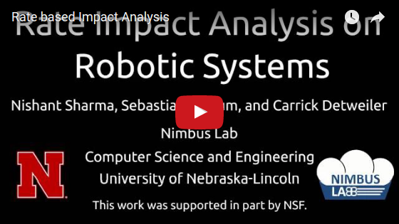

# *RSIA*: *R*ate based *S*tatic *I*mpact *A*nalysis for robotic systems

Impact set generator for ROS based systems implemented in C++. Tool extracts and uses the message transfer rate information between two components to reduce the impact set size. 

- Free software: MIT License

## Demonstration

## Installation
- **Dependencies** ([Install Guide](dep_install.md)) 
	- **ROS** ([Install instructions](http://wiki.ros.org/kinetic/Installation/Ubuntu))
	- **LLVM** (version 3.9.0, requires to be built from source code)[(link)](http://llvm.org/releases/download.html#3.9.0)
	- **Clang** (version 3.9.0, requires to be built from source code)[(link)](http://llvm.org/releases/download.html#3.9.0)
	- **Pugi-XML** [(link)](http://pugixml.org/)
	- **Yaml-CPP** [(link)](https://github.com/jbeder/yaml-cpp)
	- **graphviz** [(link)](http://www.graphviz.org/)
- To Install **_Dependency Analysis (DA)_** tool [(First Pass)](DA_first_pass/README.md) [(Second Pass)](DA_second_pass/README.md)
- To Install **_Impact Analysis (IA)_** tool [(click here)](IA_tool/README.md)
- To Install **_Helper Tools (HTs)_** [(click here)](Helper_Tools/README.md)

## Examples

Instructions on how to use *__RSIA__* on a sample system can be found [here](examples/README.md).

## Features

#### Dependency Analysis Tool
- Generates system dependency graph from source code
- Annotation of graph edges with rate-independent labels

#### Impact Analysis Tool
- DFS based component reachability analysis starting at a changed node
- Configurable stopping conditions for graph exploration 
- Simulation of traditional IA techniques

#### Helper Tools

- Parsing of ROS based `.launch` files 
- One click build of whole system

## Credits

[NIMBUS Lab](nimbus.unl.edu) at the University of Nebraska, Lincoln.

This work was partially supported by NSF under awards #1526652 and #1638099 and USDA-NIAF #2013-67021-20947.
